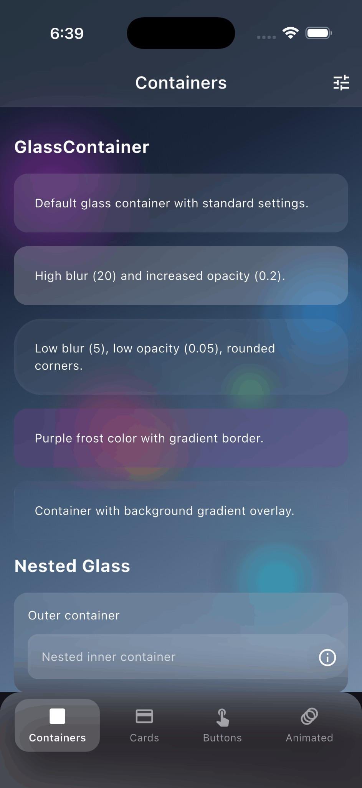
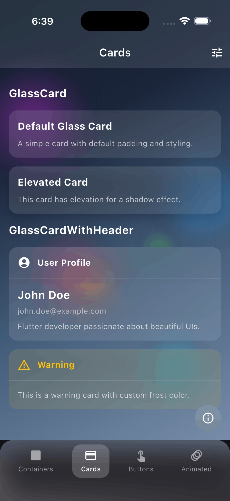
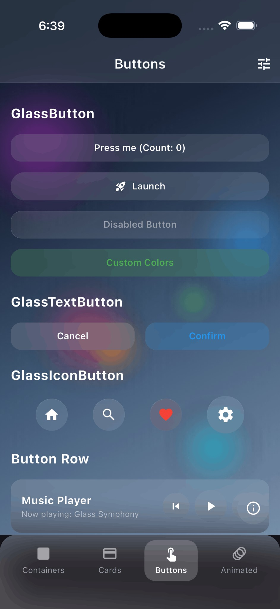
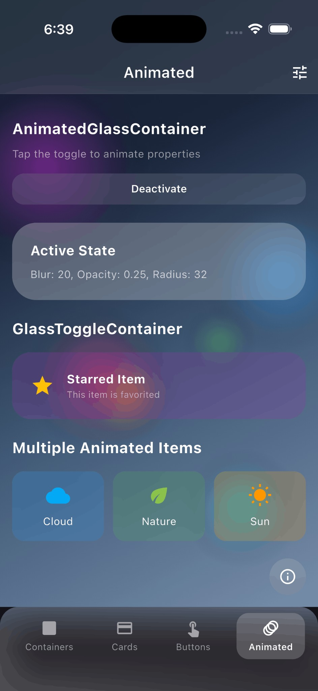
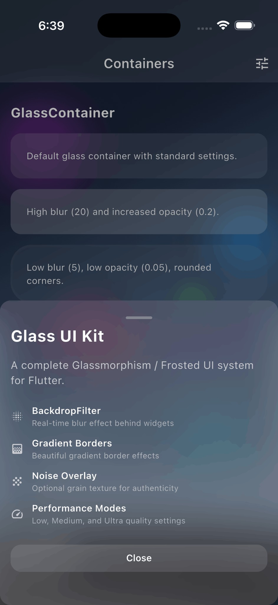

# Glass Morphism Kit

A complete Glassmorphism / Frosted Glass UI system for Flutter inspired by Apple's design language. Create beautiful frosted glass effects with blur, translucency, and subtle borders.

[](https://pub.dev/packages/flutter_glass_ui_kit)
[](https://flutter.dev)
[](https://dart.dev)
[](https://opensource.org/licenses/MIT)
[](https://github.com/DivyanshVish)

## Features

- **Apple-style frosted glass** - Authentic glassmorphism matching iOS/macOS aesthetics
- **High-performance blur** - Optimized `BackdropFilter` with cached `ImageFilter`
- **Multiple components** - Container, Card, Button, BottomSheet, AppBar
- **Animated transitions** - Smooth implicit animations for all properties
- **Performance modes** - Low and Medium quality settings
- **Zero dependencies** - Pure Flutter, no external packages
- **Fully customizable** - Blur, opacity, colors, borders, and more

## Screenshots

<p align="center">
  
  
  
  
</p>

<p align="center">
  
</p>

| Screenshot | Description |
|------------|-------------|
| Containers | Frosted glass containers with blur effect |
| Cards | Glass cards with headers and elevation |
| Buttons | Interactive glass buttons with press animation |
| Animated | Animated glass containers with smooth transitions |
| Bottom Sheet | Modal bottom sheet with glass effect |

## Installation

Add this to your package's `pubspec.yaml` file:

```yaml
dependencies:
  flutter_glass_ui_kit: ^1.0.4
```

Or install via command line:

```bash
flutter pub add flutter_glass_ui_kit
```

## Quick Start

```dart
import 'package:flutter_glass_ui_kit/flutter_glass_ui_kit.dart';

// Wrap your app with GlassTheme
GlassTheme(
  data: GlassThemeData.dark(),
  child: MaterialApp(...),
)

// Use glass containers
GlassContainer(
  child: Text('Hello Glass'),
)
```

## Components

### GlassContainer

The core container widget with frosted glass effect.

```dart
GlassContainer(
  blur: 80.0,
  opacity: 0.1,
  borderRadius: BorderRadius.circular(16),
  padding: EdgeInsets.all(16),
  child: Text('Frosted Glass'),
)
```

### GlassCard

A card widget with glass styling and optional elevation.

```dart
GlassCard(
  elevation: 8,
  child: Column(
    children: [
      Text('Card Title'),
      Text('Card content goes here'),
    ],
  ),
)
```

With header:

```dart
GlassCardWithHeader(
  header: Text('Profile'),
  content: Text('User information here'),
)
```

### GlassButton

Interactive button with press animation and haptic feedback.

```dart
GlassButton(
  onPressed: () => print('Pressed!'),
  child: Text('Click Me'),
)

// Icon button
GlassIconButton(
  icon: Icons.favorite,
  onPressed: () {},
)

// Text button
GlassTextButton(
  text: 'Submit',
  onPressed: () {},
)
```

### GlassAppBar

App bar with frosted glass effect.

```dart
Scaffold(
  extendBodyBehindAppBar: true, // Important!
  appBar: GlassAppBar(
    title: Text('Glass App Bar'),
    actions: [
      IconButton(icon: Icon(Icons.search), onPressed: () {}),
    ],
  ),
  body: ...,
)
```

### GlassBottomSheet

Keyboard-aware modal bottom sheet.

```dart
showGlassBottomSheet(
  context: context,
  builder: (context) => GlassBottomSheet(
    child: Column(
      mainAxisSize: MainAxisSize.min,
      children: [
        Text('Bottom Sheet Title'),
        GlassButton(
          onPressed: () => Navigator.pop(context),
          child: Text('Close'),
        ),
      ],
    ),
  ),
);
```

Scrollable variant:

```dart
showGlassScrollableBottomSheet(
  context: context,
  header: Text('Options'),
  children: [
    ListTile(title: Text('Option 1')),
    ListTile(title: Text('Option 2')),
  ],
);
```

### AnimatedGlassContainer

Smoothly animate property changes.

```dart
AnimatedGlassContainer(
  blur: isActive ? 80.0 : 40.0,
  opacity: isActive ? 0.15 : 0.1,
  duration: Duration(milliseconds: 300),
  child: Text('Animated'),
)
```

Toggle container:

```dart
GlassToggleContainer(
  isActive: isSelected,
  activeBlur: 80,
  inactiveBlur: 40,
  activeFrostColor: Colors.blue,
  inactiveFrostColor: Colors.white,
  child: Text('Toggle me'),
)
```

## Theming

### GlassTheme

Provide consistent styling across your app:

```dart
GlassTheme(
  data: GlassThemeData(
    blur: 80.0,
    opacity: 0.1,
    performance: GlassPerformance.medium,
    borderRadius: BorderRadius.circular(20),
    frostColor: Colors.white,
  ),
  child: MaterialApp(...),
)
```

### Preset Themes

```dart
// Dark theme (recommended for colorful backgrounds)
GlassTheme(
  data: GlassThemeData.dark(),
  child: ...,
)

// Light theme
GlassTheme(
  data: GlassThemeData.light(),
  child: ...,
)
```

## Performance Modes

Control rendering quality with `GlassPerformance`:

```dart
GlassContainer(
  performance: GlassPerformance.medium,
  child: Text('Full quality'),
)
```

| Mode | Blur | Description |
|------|------|-------------|
| Low | 50% | Reduced blur for better performance |
| Medium | 100% | Full blur with gradients |

Use `low` for:
- Lists with many glass items
- Low-end devices
- Complex UIs with multiple glass layers

## Customization

### Properties

| Property | Type | Default | Description |
|----------|------|---------|-------------|
| `blur` | double | 80.0 | Blur sigma (higher = more frosted) |
| `opacity` | double | 0.1 | Frost color opacity (lower = more transparent) |
| `borderRadius` | BorderRadius | 16.0 | Corner radius |
| `borderWidth` | double | 0.5 | Border stroke width |
| `borderGradient` | Gradient | white gradient | Gradient for border highlight |
| `frostColor` | Color | white | Tint color for the glass |
| `performance` | GlassPerformance | medium | Rendering quality |

### Custom Colors

```dart
GlassContainer(
  frostColor: Colors.blue,
  opacity: 0.15,
  borderGradient: LinearGradient(
    colors: [
      Colors.blue.withOpacity(0.5),
      Colors.blue.withOpacity(0.1),
    ],
  ),
  child: ...,
)
```

## Best Practices

1. **Use `extendBodyBehindAppBar: true`** when using `GlassAppBar` to see content behind it.

2. **Use colorful backgrounds** - Glass looks best over vibrant, colorful backgrounds where the blur effect is visible.

3. **Keep opacity low** (0.1-0.15) - Let the blur do the work, not the color overlay.

4. **Choose appropriate performance mode**:
   - Use `low` for lists with many glass items
   - Use `medium` for hero elements and single containers

5. **Avoid deep nesting** of glass containers as each adds a blur layer.

## Example

See the [example](example/) directory for a complete demo application.

```bash
cd example
flutter run
```

## Requirements

- Flutter 3.10.0 or higher
- Dart 3.0.0 or higher
- No external dependencies

## API Reference

### Core Widgets
- `GlassContainer` - Base glass container
- `GlassCard` - Glass card with padding
- `GlassCardWithHeader` - Card with header section
- `GlassButton` - Interactive glass button
- `GlassIconButton` - Circular icon button
- `GlassTextButton` - Text-only button
- `GlassBottomSheet` - Modal bottom sheet
- `GlassScrollableBottomSheet` - Scrollable bottom sheet
- `GlassAppBar` - Glass app bar
- `GlassSliverAppBar` - Sliver variant

### Animation
- `AnimatedGlassContainer` - Implicit animations
- `GlassToggleContainer` - Two-state toggle

### Theming
- `GlassTheme` - InheritedWidget for theming
- `GlassThemeData` - Theme configuration
- `GlassPerformance` - Quality modes

### Utilities
- `GlassBorderPainter` - Custom border painter
- `GlassNoiseOverlay` - Grain texture (optional)

## Author

**Divyansh Vishwakarma**

- GitHub: [@DivyanshVish](https://github.com/DivyanshVish)
- LinkedIn: [Divyansh Vishwakarma](https://www.linkedin.com/in/divyansh-vishwakarma-a0a003239)
- Instagram: [@vishwakarma.divyansh](https://instagram.com/vishwakarma.divyansh)

## Contributing

Contributions are welcome! Please read our contributing guidelines before submitting a PR.

## License

This project is licensed under the MIT License - see the [LICENSE](LICENSE) file for details.

## Acknowledgments

- Inspired by Apple's iOS and macOS design language
- Built with Flutter's `BackdropFilter` and `ImageFilter`
